== User guide
:experimental:

This document provides guidelines for using the Credentials API.

This document is structured as follows:

* The first section provides some background into the use cases driving the development of the Credentials API.

* The second section is an overview of all the functionality provided by the Credentials API.

* The subsequent sections consider how to use the different pieces of functionality provided by the Credentials API.

=== Background

In the ideal world, we wouldn't need any secrets in order to build and deploy software or perform any of the other automation tasks that Jenkins can be co-opted into.

But the reality is that in almost all cases even something as basic as building software requires at least one secret:

* You need a SCM username/password to checkout the source code to build

Once you start using Jenkins for more than just Continuous Integration, you are going to find more and more use cases for needing to share secrets with Jenkins:

* Building the release version of the application requires signing the application using a code signing key.
* Deploying the application to staging requires the credentials for the staging environment
* Deploying the application to production requires the credentials for the production environment
* Updating the issue tracker with details of relevant Jenkins builds requires credentials for the issue tracker
* etc.

Before the introduction of the Credentials API plugin (in early 2012), each Jenkins plugin was responsible for managing their own credentials.
This meant that you would have to give the Subversion plugin a username and password, you would also need to give the JIRA plugin a username and password, etc.
Perhaps the biggest issue would occur every 45-90 days...
We should all know that https://pages.nist.gov/800-63-3/[the current NIST standards] recommend against enforced periodic password rotation, but a lot of corporate IT SECURITY policies still mandate it.
So your password has changed, welcome to hell where you have to race to change all the places that you stored that password in Jenkins before it attempts to use the old password more than three times causing your account to be locked out, phone up the help-desk, get your password reset _again_ and repeat.

This exact use case was the driver for the initial development of the Credentials API plugin.

With the Credentials API plugin, we get:

* An API for plugin authors to use to define credential types
* An API for plugin authors to use to integrate external credentials stores with Jenkins
* An API for plugin authors to use to retrieve credentials from credentials stores (transparently integrating the internal/external credentials stores)
* A UI for users to manage the credentials available to Jenkins.

For the Jenkins user, this means that when the password (or other secret) needs updating, they only have to update it once and all the plugins that have been using those credentials will immediately switch to the new password, lockout prevented.

.The Jenkins-internal credentials store
[WARNING]
====
While the Credentials API plugin provides a default _internal_ credentials store, the intent is that other, more secure, _external_ credentials stores will provide integrations with the Credentials API.

If you are using the _internal_ credentials store to store *high value* credentials then you will need to lock down your Jenkins configuration:

* Apply all of the recommendations from the  https://wiki.jenkins.io/display/JENKINS/Securing+Jenkins[Securing Jenkins] wiki page.
* No builds on the master (ideally zero executors)
* Probably use the https://plugins.jenkins.io/authorize-project[Authorize Project plugin] to control effective permission of running builds.
* etc.

If a non-trusted user can gain access to the files in the `JENKINS_HOME/secrets` directory, then it is game over.

While the above security recommendations are generally valid for any situation where Jenkins has access to *high value* credentials, because:

* the _internal_ store is stored in the `JENKINS_HOME`
* the _internal_ store is encrypted using a key that is also stored in `JENKINS_HOME`
* the JVM running Jenkins must have access to these files

It becomes critical to secure the filesystem of the Jenkins master process.

With an _external_ credentials store, access to the Jenkins master filesystem will not generically compromise credentials.
In the event of a breach, the last-accessed tracking facilities of an enterprise-grade external store will enable identification of _at risk_ credentials in need of rotation.
====

=== Overview

In order to understand how to manage credentials with the Credentials API plugin, you need to understand a number of Jenkins concepts:

* Contexts within Jenkins
* Authentication within Jenkins
* The Jenkins security model

The Credentials API plugin introduces some more concepts:

* Credentials types
* Credentials scopes
* Credentials domains
* Credentials providers
* Credentials stores

There are three ways to manage credentials with the Credentials API:

* Through the Web UI
* Through the REST API
* Through the Jenkins CLI

The holy grail is that each credentials selection lists will display exactly the relevant credentials:

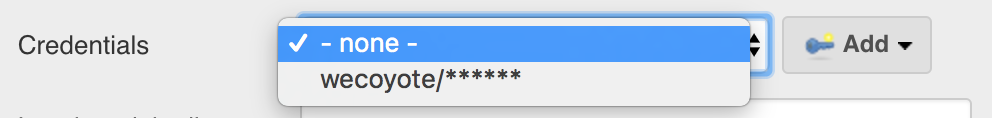

==== Contexts within Jenkins

Jenkins implements a hierarchical context model.
Every context within Jenkins has a chain of parent contexts leading ultimately to the root context.

The root context is Jenkins itself.
Plugins can define additional child contexts, for example the https://plugins.jenkins.io/cloudbees-folder[Folders plugin] adds the Folder context, but by default Jenkins provides the following child contexts from the root context:

Jobs:: Each job is its own context, the individual builds of a job could be considered as child contexts, but no plugins currently make use of that potential.
Users:: Each user recorded by Jenkins has their own context.
Build agents:: Build agents have their own context, though this is typically not really relevant from the point of view of credentials.
Views:: Views have their own context. It is important to note that jobs are only weakly associated with views, they are not child contexts of the views they are members of.

The hierarchical nature of contexts becomes more relevant once plugins such as the https://plugins.jenkins.io/cloudbees-folder[Folders plugin] are installed as then you can have more complex trees of jobs.

==== Authentication within Jenkins

Jenkins is a multithreaded application.
Each execution thread has an associated authentication.
There are three classes of authentication that a thread can be associated with:

* `ACL.SYSTEM` this is the super-user authentication of the Jenkins master process itself.
Also known as `SYSTEM`.
Any actions performed by Jenkins itself will start in a thread using this authentication.
* A user authentication, this type of authentication is assigned to any web/CLI requests by a logged in user.
Additionally, plugins like https://plugins.jenkins.io/authorize-project[Authorize Project plugin] can be used to configure jobs to run as specific users or even as the user that triggered the job.
* `Jenkins.ANONYMOUS` this is the authentication of a web/CLI request that has not been authenticated.
Also known as `ANONYMOUS`.
Additionally, plugins like https://plugins.jenkins.io/authorize-project[Authorize Project plugin] can be used to configure jobs to run as `ANONYMOUS`.

==== The Jenkins security model

Jenkins uses a permissions based security model.
Different operations have different permissions.
Plugins can define their own permissions.

To determine whether an operation can be performed, Jenkins asks the currently configured authorization strategy whether a specific authentication has the required permission in a specific context.

The authorization strategy is an extension point and there are multiple plugins providing their own implementations.
In most cases, these strategies are mostly hierarchical, so if an authentication has a permission in a parent context it will typically have the same permission in the children of that context.

[NOTE]
====
Authorization strategies that provide for use-cases such as secret skunkworks projects may provide for removal of permissions from child contexts.
====

In short, each authorization strategy is provided with the :

* Permission requested
* Authentication requesting
* Context of request

And returns a `yes` / `no` answer.

==== Credentials types

Most people tend to think of there being only 5 or 6 types of credentials / secrets:

* Password
* Username and password
* SSH private key
* Public Certificate and private key
* Binary blob data
* That OAuth thingy

If we wanted to take things further, we could abstract them all away into some secret bytes and a list of non-secret named properties.

From the point of view of somebody implementing a credentials management system, it is indeed tempting to reduce credentials down to this basic primitive.
From the perspective of users and Jenkins, the reduction may end up throwing away useful information to assist in selecting the correct credentials to use for different situations.

For example, technically you could choose to store the SSH private key in the "password" field of a Username and Password (assuming there is no upper limit on password length).
How would a user know that `wecoyote/*****` is the password credential while `wecoyote/*****` is the one that shoved the SSH private key into the password field?
How would Jenkins know whether to try the password field contents as a password or as a SSH private key?

Different plugins will provide different credentials types.

How are we supposed to determine which type to use?

You should choose the type based on the ability for the underlying secret to be consumed by other systems.
This principle is best illustrated by examples:

* _What credentials type should I choose for entering my username and password for use to update the issue tracker?_
+
So the thing about issue trackers is that very often they can be integrated with the corporate single-sign-on service.
If that is the case, then there is a realistic chance that I might need to reuse the username and password to authenticate with the source control system, etc.
Thus, we probably should prefer the more generic _Username and password_ credentials type, because the secret will likely be used by other plugins.

* _What credentials type should I choose for entering my username and application token for use to update the issue tracker?_
+
Application tokens are typically generated by a service and associated with a user account.
They are designed to take the place of a password for that specific service and typically they will only ever be displayed one time to the user.
The user can see the details of last use for each application tokens and can choose to revoke the application token at any time.
In this case there is zero chance of the application token being used by another service.
We should use the most specific credentials type supported by the plugins we are using.
So if there is a _Acme Corp Issue Tracker Application Token_ credentials type provided by the _Acme Corp Issue Tracker_ plugin, even though the application token is logically equivalent to a password, we should choose the specific credentials type.
If the plugin doesn't provide a dedicated credentials type, then in that case we would fall back to Username and Password and we would likely have to leverage <<credentials-domains,Credentials Domains>> to try and recreate some of the contextual information that a service specific credentials can provide.

[NOTE]
====
The Jenkins Administrator can configure which credentials types are actually permitted to be used in a Jenkins instance using the menu:Jenkins[Manage Jenkins > Configure Credentials] screen
====

==== Credentials scopes

Each credentials instance in the Credentials API plugin has an associated scope.
The scope defines how the credentials can be exposed.

System scope::
This scope is only available in credentials stores associated with the root context.
System scope credentials are exposed to the Jenkins system / background tasks.
For example, a system scoped credential can be used to connect a build agent or to globally manage post-commit web hooks in a source control system.

Global scope::
This scope is the default scope.
Global scope credentials are exposed to their associated context and all child contexts.
If you want credentials to be generally available to jobs, use Globals scope.

User scope::
This scope is the only scope available in the per-user credentials store.
User scope credentials are only available to threads using that user's authentication.

There are also two _hidden_ permissions that interact with credentials scopes:

* https://github.com/jenkinsci/credentials-plugin/blob/dc35d4d99f9d4e9bf5fd434aee4f6e1bfca4c47d/src/main/java/com/cloudbees/plugins/credentials/CredentialsProvider.java#L144[`Credentials/UseOwn`] which by default is implied by the `Item/Build` permission but can be turned into a distinct permission with the system property `com.cloudbees.plugins.credentials.UseOwnPermission`.
* https://github.com/jenkinsci/credentials-plugin/blob/dc35d4d99f9d4e9bf5fd434aee4f6e1bfca4c47d/src/main/java/com/cloudbees/plugins/credentials/CredentialsProvider.java#L160[`Credentials/UseItem`] which by default is implied by the `Job/Configure` permission but can be turned into a distinct permission with the system property `com.cloudbees.plugins.credentials.UseItemPermission`.

[NOTE]
====
By default, and unless the https://plugins.jenkins.io/authorize-project[Authorize Project plugin] has been installed, jobs running in Jenkins will be running as `ACL.SYSTEM` and will only be able to access global scoped credentials.

If you install the https://plugins.jenkins.io/authorize-project[Authorize Project plugin] and configure a job to run as a specific user, the credentials available to that job will now be determined by that user's permissions in the context of that job.
If the user does not have either `Credentials/UseOwn` (normally implied by `Item/Build`) or `Credentials/UseItem` (normally implied by `Job/Configure`) then the job will be unable to access any credentials at all.
====

If a user has `Credentials/UseOwn` permission in a specific context then they are allowed to use their user scoped credentials for actions performed with their authentication in that context.
For example, jobs running as the user's authentication will have access to that user's user scoped credentials if and only if the user has `Credentials/UseOwn` permission in the context of that job.

If a user has `Credentials/UseItem` permissions in a specific context then they are allowed to use the global scoped credentials for actions performed with their authentication in that context.
For example, jobs running as the user's authentication will have access to the global scoped credentials available in the context of that job if and only if the user has `Credentials/UseItem` in the context of that job.

[[credentials-domains]]
==== Credentials domains

The ideal case for managing credentials with the Credentials API plugin is that each service that you have to interact with has a distinct independent secret lifecycle and a dedicated service specific credentials type.
In other words:

* The secret used to connect to one service is never (other than accidentally) the same as the secret used to connect to any other service.
* Resetting the secret for one service will never trigger a reset of the secrets for other services (procedurally you might have to reset them all after say a security breach, but they are not inherently linked)

So, for example, you might have:

* a Google Authentication type that stores credentials used to interact with Google's services;
* an AWS Authentication type that stores credentials used to interact with AWS;
* a Twitter Authentication type that stores the credentials used to tweet about releases after they have been deployed to Google or AWS;
* a GitHub Authentication type that stores the credentials used to connect to GitHub;
* etc

Now the above would be OK, because - unless there are some corporate mergers - we do not expect the secret used to connect to Google to be the same as the secret used to connect to AWS or Twitter or GitHub.

In the enterprise world, typically the services can be moved in-house and with single-sign-on will likely end up using username and password credentials.

Not every system will integrate with single-sign-on though, so it is likely that there will be multiple username and password credentials with the same username but for different systems.

How can we recover the "type" information that we lost when we selected _Username and Password_?

The answer is _Credentials Domains_.

You define a credentials domain and you provide a specification.
The specification will be something like:

* Only hostname `myservice.example.com`
* Only URLs with the `https` protocol
* Only on port 8443

Now when the credentials API is asked to list up relevant credentials it will exclude credentials from domains that do not match.

[NOTE]
====
Pay *very* close attention.

"Excluding credentials from domains that do not match" is _not_ the same as "Only including credentials from domains that do match".
====

Initially, there is only one credentials domain, the global domain.
The global domain has no specification, so credentials in the global domain will always match any set of domain requirements.

.Example
****
If we have credentials in four different domains:

global::
 Global domain
secure-service::
A domain with the specification: hostname is `myservice.example.com`; protocol is `https`; port is `443`.
public-service::
A domain with the specification: hostname is `myservice.example.com`; protocol is `http`; port is `80`.
source-control::
A domain with the specification: hostname is `myscm.example.com`; protocol is `https`; port is `443`.

We start typing in the URL of the service we want to connect to.

The URL is empty, so the drop-down list will show credentials from all four domains.

Suppose we now have typed in `https://`, at this point the requirements are just that the protocol is `https`, so as *public-service* has a specification of `http` it is excluded from the drop-down list.

Suppose we now type in `https://myservice.example.com`, at this point we have the requirements: protocol is 'https' and hostname is 'myservice.example.com', so both *public-service* and *source-control* are now excluded.

Finally, suppose we had typed in `myservice.example.com`, in this case we exclude only `source-control` as the requirements are just that the hostname is `myservice.example.com`

In all cases, the credentials from the *global* domain are always present.
****

[TIP]
====
The use-case for credentials domains is to provide a way for the user to provide information about the services with which the credentials are expected to work.

Credential domains are intended to help select correct credentials for each services.

Credential domains are not intended to prevent credentials from being used against the wrong services.

In some cases, the domain requirements of a credential cannot be determined, such as when using a credentials parameter or when using a plugin that has not fully implemented the recommendations of the link:consumer.adoc[consumer guide].

In order to ensure that users can actually select the required credentials in these cases, the Credentials API needs to return credentials from all domains, which is why we use _Excluding credentials from domains that do not match_.

Because of the above: *Credential domains are not intended to restrict access to credentials.*

If you need to restrict access to credentials put those credentials in a context that limits their usage, e.g. create a "Deployment" folder and put the keys for deploying into the "Deployment" folder, restrict access to the "Deployment" folder to only those users permitted to deploy.
====

==== Credentials providers

The Jenkins extension point `CredentialsProvider` is responsible for connecting Jenkins to an external credentials vault.

Not everyone will be exposing *high value* credentials to Jenkins.
Similarly, not everyone needs the complexity of an enterprise credentials vault.
For people who do not need to use an enterprise credentials vault, the Credentials API plugin provides two credentials providers and the https://plugins.jenkins.io/cloudbees-folder[Folders plugin] adds another for the folders contexts it adds to Jenkins.

[NOTE]
====
The Jenkins Administrator can configure which credentials providers are actually permitted to be used in a Jenkins instance using the menu:Jenkins[Manage Jenkins > Configure Credentials] screen
====

The standard credentials providers are:

System Credentials Provider::
** This credentials provider exposes a credentials store at the root context.
** The credentials store supports credentials domains.
** The credentials store supports two scopes: *system* and *global*.
** The credentials store can be inspected from menu:Jenkins[Credentials>System].

User Credentials Provider::
** This credentials provider exposes a per-user credentials store for each user.
** The credentials store supports credentials domains.
** The credentials store only supports *user* scope.
** The credentials store can be inspected from either menu:Jenkins[__username in the banner bar__>Credentials>User] or  menu:Jenkins[People>__username__>Credentials>User].
** A user cannot access the per-user credentials store of another user.

The https://plugins.jenkins.io/cloudbees-folder[Folders plugin] adds the following credentials provider:

Folder Credentials Provider::
** This credentials provider exposes a per-folder credentials store in the context each folder.
** The credentials store supports credentials domains.
** The credentials store only supports *global* scope which will expose the credentials to any children of the folder.
** The credentials store can be inspected from menu:Jenkins[__folder name__>Credentials>Folder]

==== Credentials stores

Credentials providers expose credentials to Jenkins through the credentials store extension point.

* A credentials store is associated with a specific context within Jenkins.
* A credentials store either only supports the global domain or has full support for custom domains.
* A credentials store will support a defined list of credentials scopes.
* Some credentials stores are read-write and others are essentially read-only derived from a computation.
* _Internal_ credentials stores will be responsible for storing the actual credentials.
* _External_ credentials stores can work in a number of different ways depending on the backing external service:
** In some cases the external service provides essentially a flat namespace of credentials without any ability to infer structure or list available credentials.
+
In these cases the external credentials store will hold the credentials identifiers and any categorization within credentials domains.
+
In some cases the credentials store may need to store additional metadata in order to reconstruct the Jenkins credentials.
** In some cases the external service provides a very rich metadata model and query language.
+
Jenkins can leverage a metadata property to associate credentials with the different Jenkins contexts and perhaps even with infer credentials domains.
+
This type of credentials store is typically read-only though an advanced implementation may be able to create credentials in the external vault and thereby present as a read-write store.

=== Administrative controls

The administrative controls are available from menu:Jenkins[Manage Jenkins>Configure Credentials]:

.The menu:Jenkins[Manage Jenkins>Configure Credentials] defaults
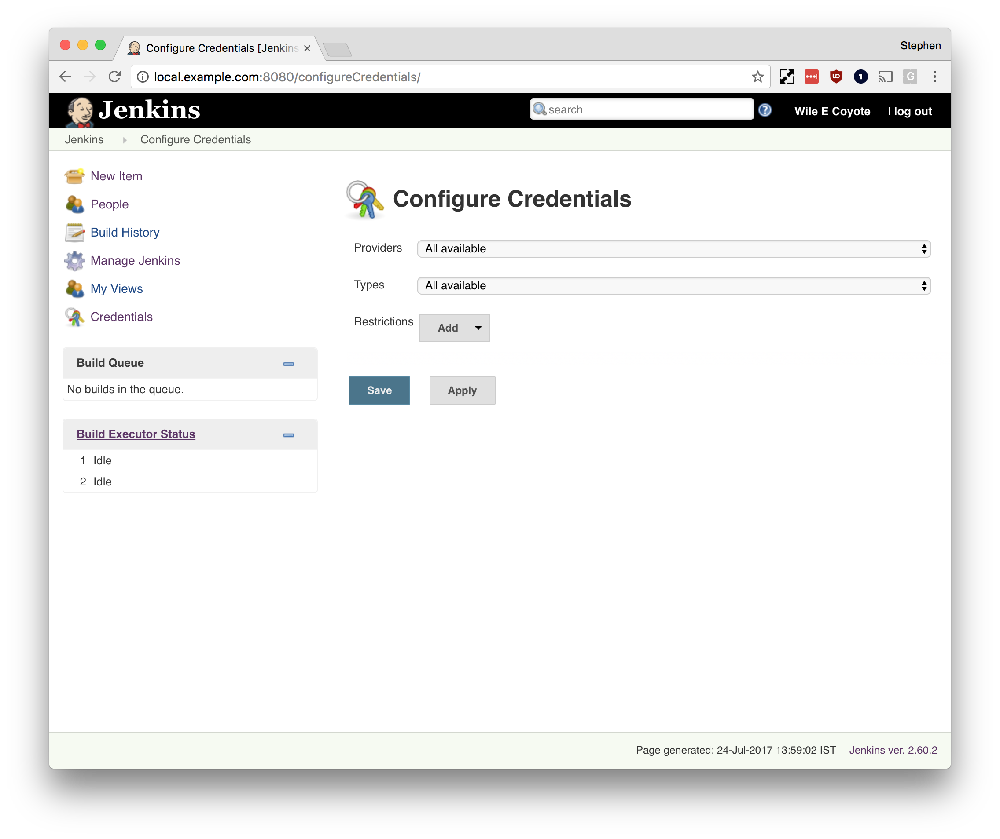

This allows for control over:

* the installed credentials providers that can be used to resolve credentials
* the installed credentials types that can be configured and resolved
* fine-grained configuration of specific credentials types on specific providers

Credentials providers can be configured using the Providers option

.Restricting the available credentials providers to a subset of those installed.
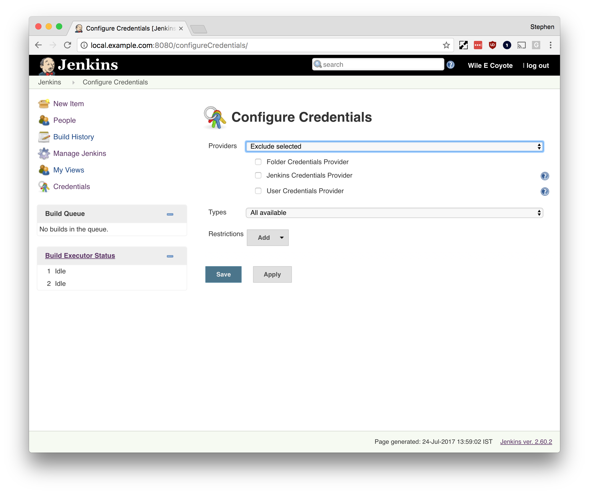

For example if you want to prevent user's from being able to store credentials in the per-user credentials store you have two options:

* Configure an _Excludes selected_ that targets the per-user credentials provider.
+
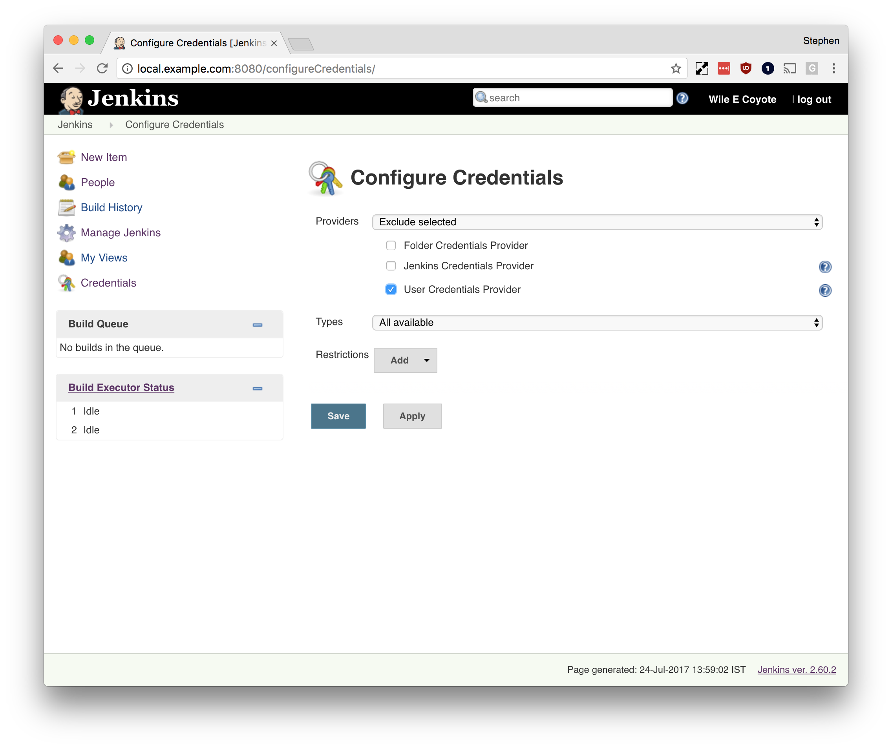
+
This has the side-effect that when you install plugins with new credentials providers they will be available immediately after installation.
* Configure an _Only selected_ that targets everything but the per-user credentials provider.
+
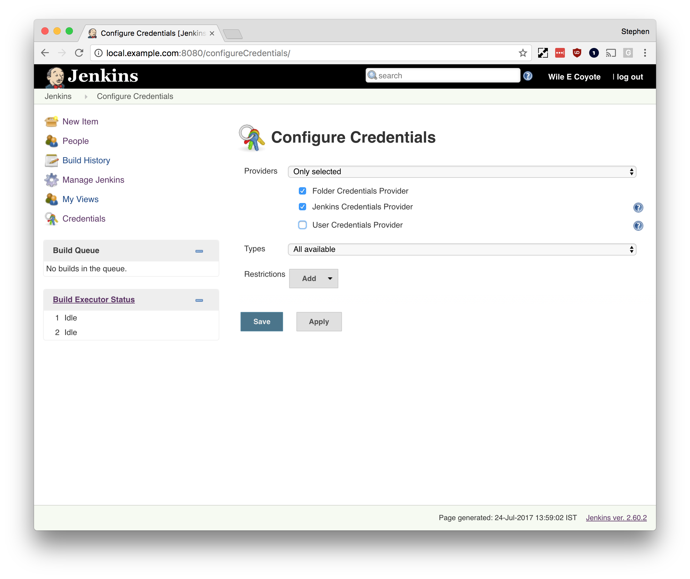
+
This has the side-effect that when you install plugins with new credentials providers you will need to configure them before they are available.

[NOTE]
====
[quote, William Shakespeare, "Hamlet: Act 2, Scene 2"]
____
there is nothing either good or bad, but thinking makes it so.
____
The two options:

* Only selected
* Exclude selected

Are logically equivalent.
The difference between these two options is in how they react as new plugins are installed.

_Only selected_ is essentially a whitelist strategy.
When new plugins are installed the configuration will not automatically select any new options to be enabled.

_Exclude selected_ is essentially a blacklist strategy.
When new plugins are installed the configuration will not automatically select any new options to be disabled.
====

The credentials types can also be configured with the same choice of: _All available_; _Exclude selected_; and _Only selected_.

.Restricting the available credentials types to a subset of those installed.
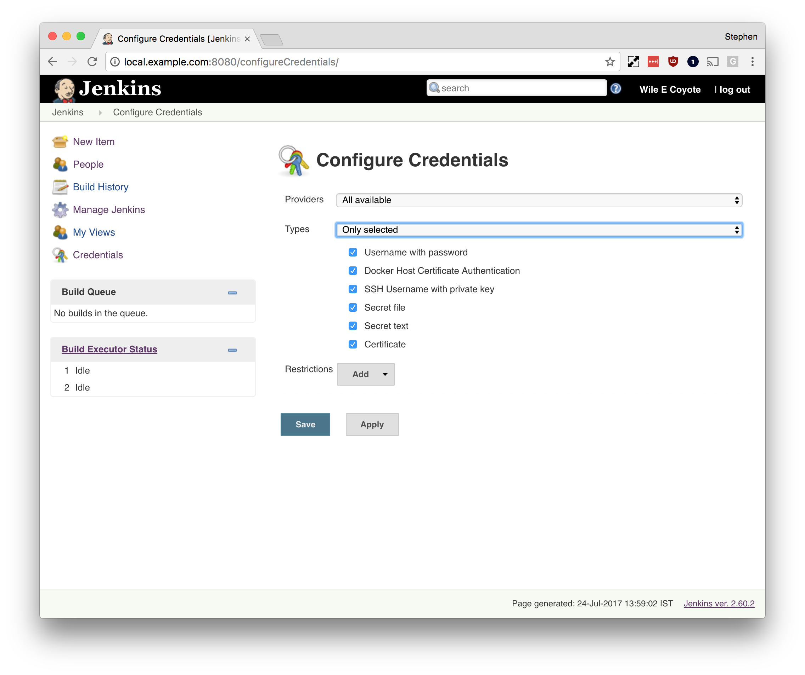

The final set of options are the fine-grained restrictions.
With these you can define include or exclude rules that determine the available credentials types for each individual credentials provider.

* The restrictions rules are applied after the global settings and cannot override the global settings.
* The restrictions rules are grouped by each credentials provider.
** If there is at least one includes rule for any specific credentials provider then only those credentials types that have include rules for that provider will be available.
** Exclude rules are applied after include rules.

.The two types of restrictions rules available
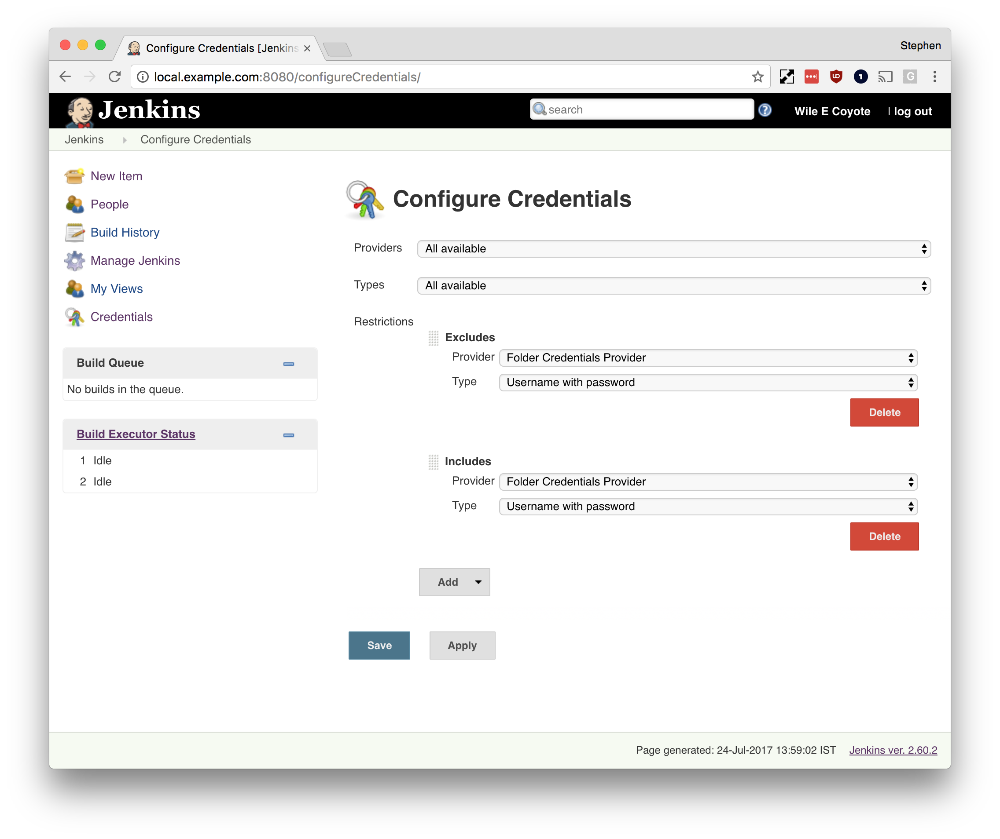

[TIP]
.Understanding the Authorize Project Plugin and Credentials
====
Jenkins associates an authentication with all internal operations.

When a user makes a request from the web browser or from the Jenkins CLI, that request is tagged with the user's authentication and permission checks will restrict the scope of that request to the user's permissions.

The internal operations of Jenkins typically run with the authentication of `SYSTEM` which is the most powerful authentication and has all permissions.

For simple build jobs, this is typically not an issue.
More complex build jobs can involve bi-directional control between Jenkins and the build job.
If the build job has the ability to control Jenkins itself, then the authentication that the build job is running as within Jenkins becomes important.

The https://wiki.jenkins-ci.org/display/JENKINS/Authorize+Project+plugin[Authorize Project plugin] was developed to allow jobs to run with a lesser authentication.

In a Jenkins instance without the Authorize Project plugin (or an alternative plugin providing a http://javadoc.jenkins-ci.org/jenkins/security/QueueItemAuthenticator.html[Queue item authenticator]) the menu:Jenkins[Manage Jenkins > Configure Global Security] screen will not show any Access control for builds options

[id=config-no-authorize-project]
.The Configure Global Security screen without any http://javadoc.jenkins-ci.org/jenkins/security/QueueItemAuthenticator.html[Queue item authenticator] plugins installed
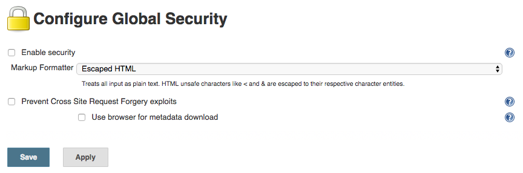

Once at least one http://javadoc.jenkins-ci.org/jenkins/security/QueueItemAuthenticator.html[Queue item authenticator] is installed in the Jenkins instance, then the configuration options will be displayed.

[id=config-authorize-project]
.The Configure Global Security screen with at least one http://javadoc.jenkins-ci.org/jenkins/security/QueueItemAuthenticator.html[Queue item authenticator] plugins installed
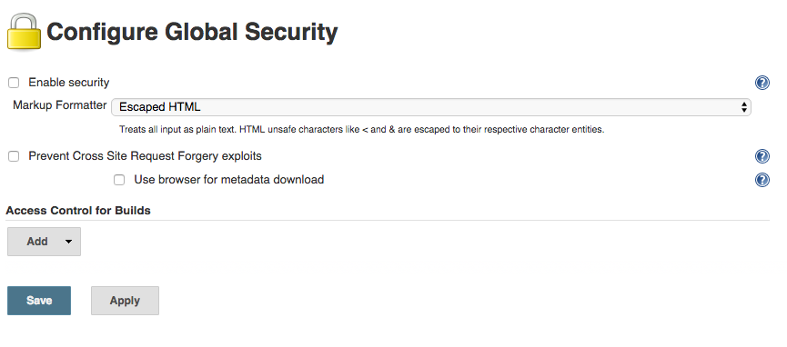

The Access Control for Builds section is an ordered list of http://javadoc.jenkins-ci.org/jenkins/security/QueueItemAuthenticator.html[Queue item authenticator].
The first one that declares an interest in providing authentication for the build job will determine the authentication that the build job will run as.

[id=config-authorize-project-config]
.The Configure Global Security screen adding the https://wiki.jenkins-ci.org/display/JENKINS/Authorize+Project+plugin[Authorize Project plugin]'s http://javadoc.jenkins-ci.org/jenkins/security/QueueItemAuthenticator.html[Queue item authenticator]
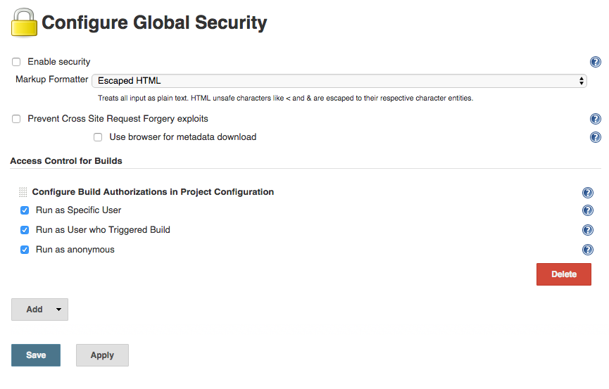

To actually use the https://wiki.jenkins-ci.org/display/JENKINS/Authorize+Project+plugin[Authorize Project plugin] you also need to enable it for the specific build job.

[id=job-config-authorize-project]
.Configuring a job to use the https://wiki.jenkins-ci.org/display/JENKINS/Authorize+Project+plugin[Authorize Project plugin]
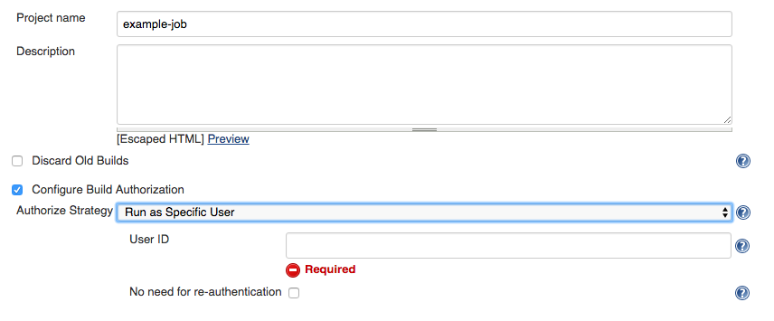

Once you switch jobs from running as `SYSTEM` you will encounter a feature of the Credentials API, namely that credentials are only exposed to specific authentications.

There is a permission within the Credentials plugin known as `Credentials/UseItem`.
In order for an authentication to be able to resolve a credentials in either the root scoped store or a folder scoped store, that authentication must have the `Credentials/UseItem` permission.

By default the `Credentials/UseItem` permission is hidden and users receive this permission through implication by the `Job/Configure` permission.
A Jenkins administrator can make the permission visible by defining the `com.cloudbees.plugins.credentials.UseItemPermission` system property with the value of `true`, e.g. by adding `-Dcom.cloudbees.plugins.credentials.UseItemPermission=true` to the Jenkins JVM start-up options.
====

=== Managing credentials

The Credentials API plugin adds a Credentials action to every context item that has at least one associated credentials store.
By default, this means that there will be a Credentials action on:

* The Jenkins root object itself
+
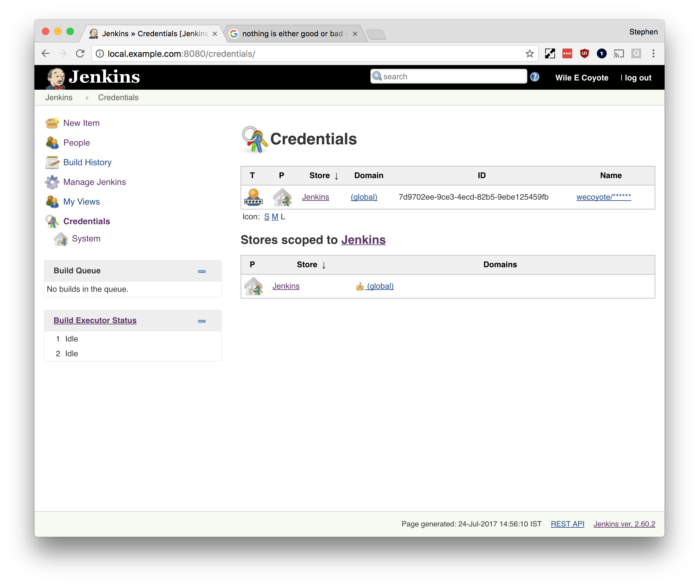
* A user within Jenkins
+
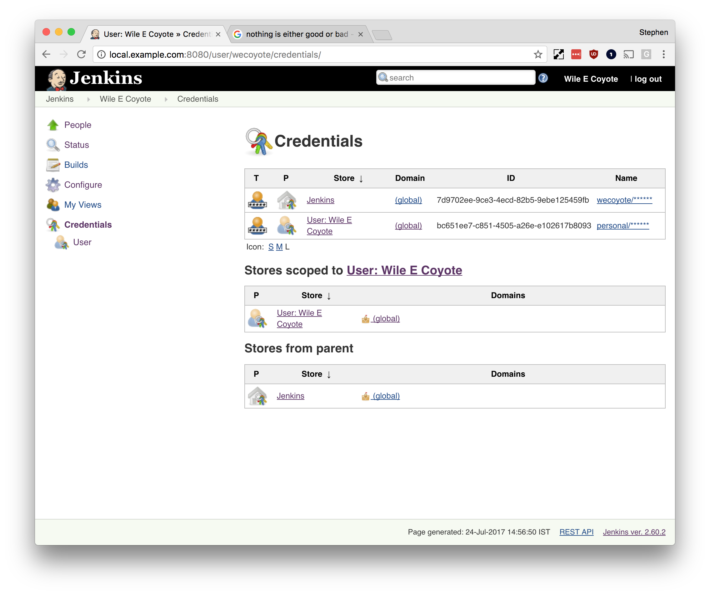
* (_If the folders plugin has been installed_) A folder within Jenkins
+
image::images/folder-credentials-action.png[scaledwidth="90%"]

These actions provide standardized interfaces for managing credentials.

.Credentials Action UI elements
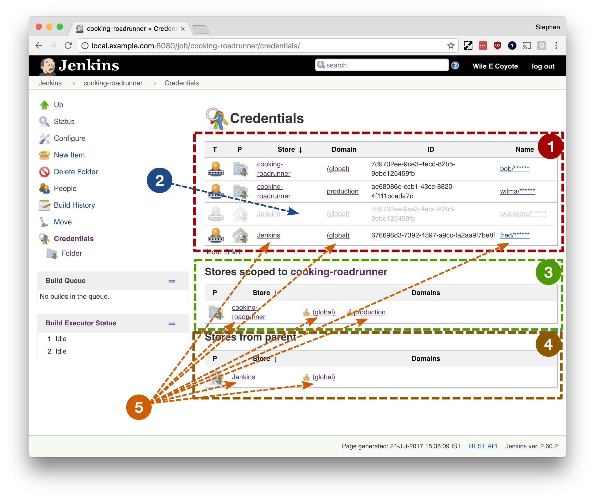
<1> Credentials available within the current context, both from the current context and parent contexts
<2> A credentials instance from a parent scope that has been masked by a credentials instance with the same ID in the current scope
<3> The credentials stores in the current context
<4> The credentials stores from parent contexts
<5> Links with context menus

The main page of the credentials action consists of three tables:

1. The credentials available within the current context.
There are six columns:
+
--
* Type
* Provider
* Store
* Domain
* ID
* Name
--
+
Any credentials from parent contexts that have been masked by credentials with a the same ID will be shown as a disabled or greyed out row.
2. The stores that are associated with the current context.
There are three columns:
+
--
* Provider
* Store
* Domains
--
3. The stores from all parent contexts.
There are three columns:
+
--
* Provider
* Store
* Domains
--

The links in the main page are all context menu links which can be used to navigate more efficiently.

.Context menus are available when the mouse hovers over links
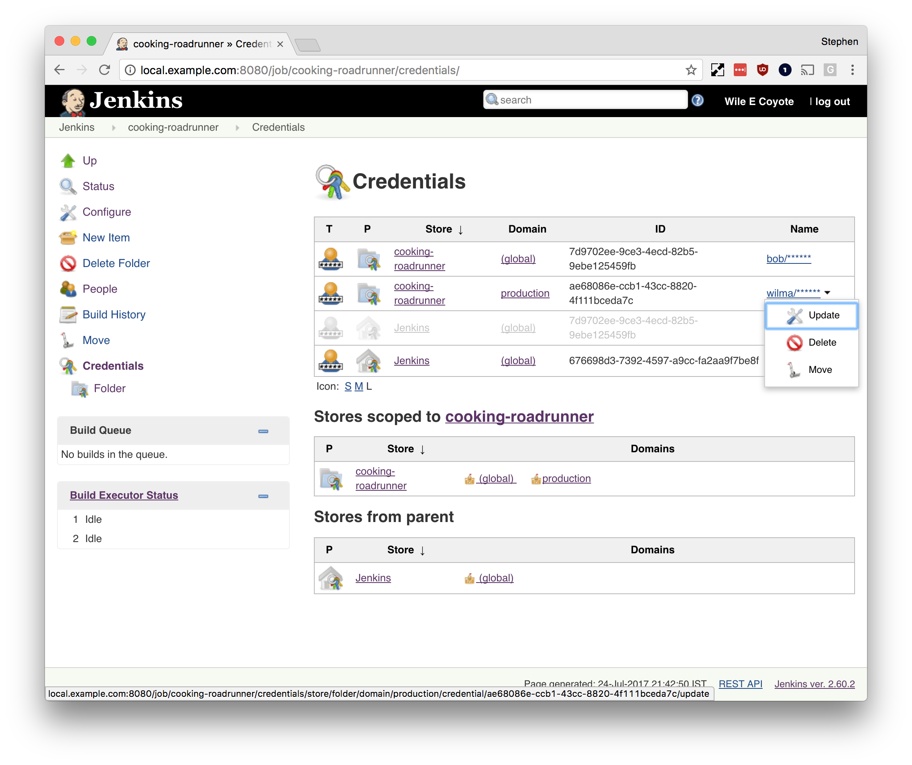

Navigating from the credentials action main page, brings you to the credentials store sub-action.

.Credentials store sub-action
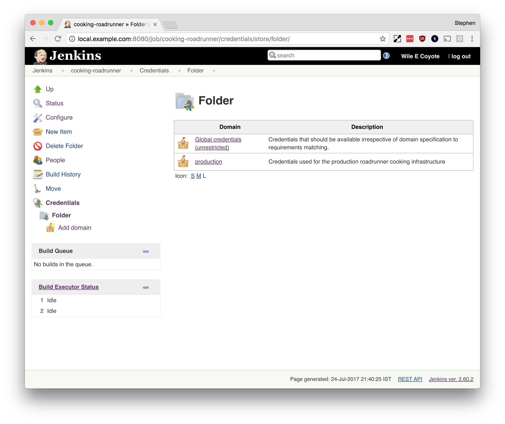

The credentials store sub-action consists of a single table with two columns:

* Domain
* Description

You can either _Add domain_ or navigate to an existing one.
The links to existing domains are all context menu enabled.

Adding a domain will display the _Add domain_ page:

.Adding a new credentials domain / configuring an existing credentials domain.
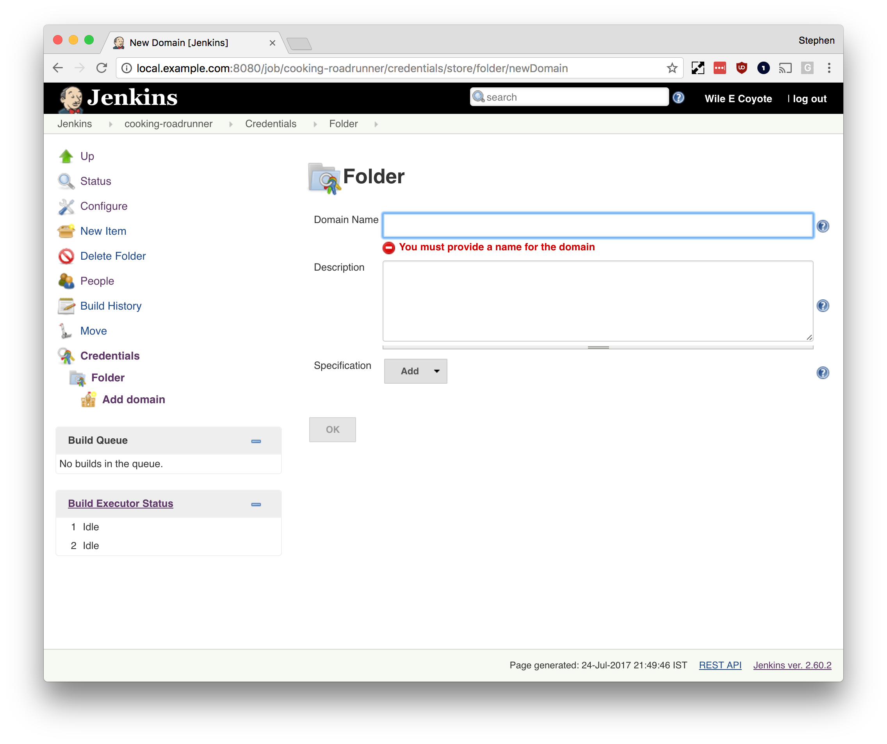

The only mandatory field is the domain name.

[NOTE]
====
The domain name is used as an URL path component so URL unsafe characters are not recommended.

If you intend to use either the REST API or the Jenkins CLI API for interacting with the domain then things will be significantly easier if you stick to alpha-numeric domain names with just `-` or `_` as a word separator.
====

It is recommended to provide a description.

If you do not provide a domain specification then the domain is effectively equivalent to the global domain, so you will probably want to define a specification.

.Adding domain specifications
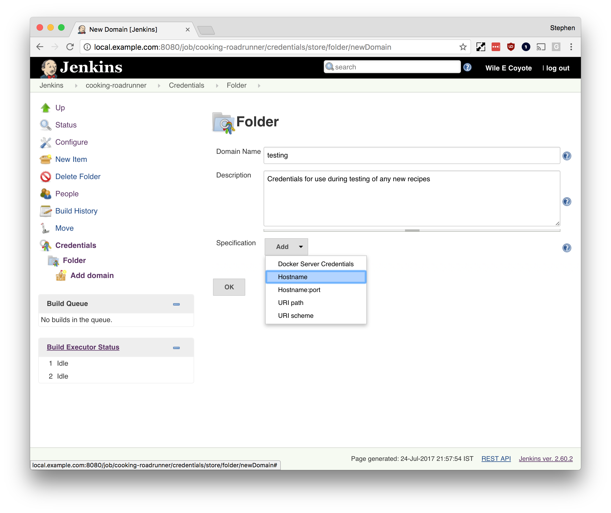

The most basic domain specification is a hostname specification

.Configuring a hostname domain specification
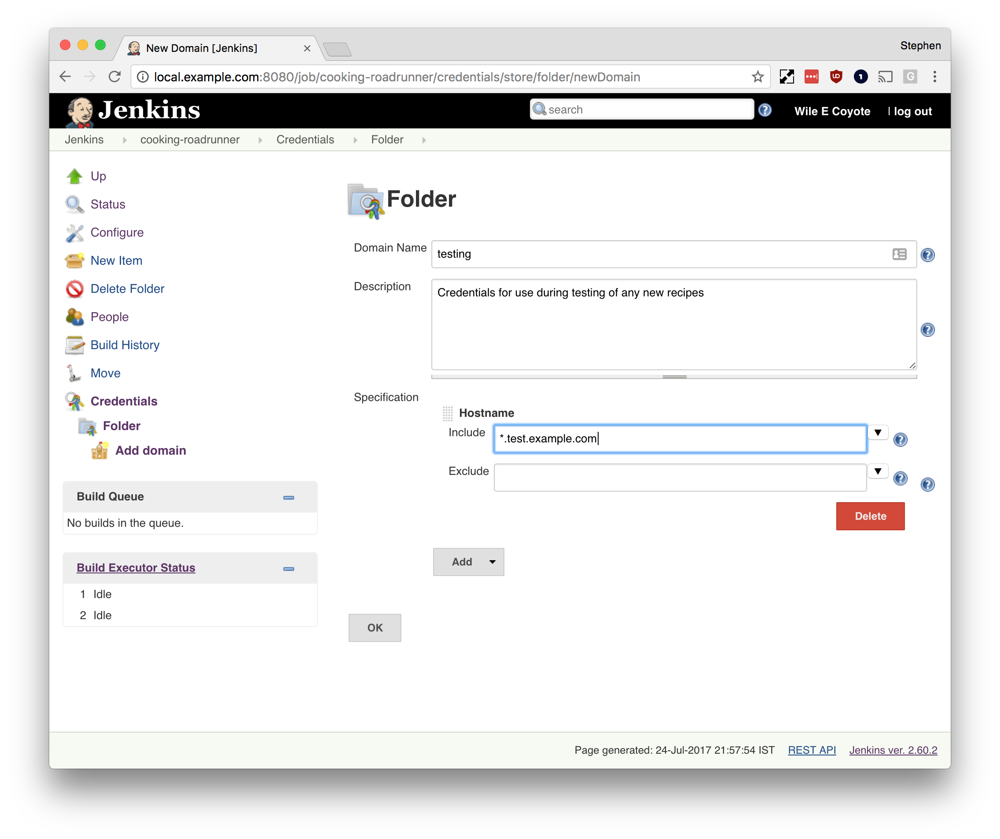

When configuring credentials domains remember:

[quote]
The credentials API will exclude credentials from domains that do *not* match.

This means that if you define a hostname specification of say, `*.test.example.com` then credentials in this domain will be available for selection in cases where the plugin populating the drop-down selection list _either_ has not declared a hostname requirement _or_ has declared a matching requirement.

The domain details page consists of a table listing all credentials defined in the domain.

.Domain details
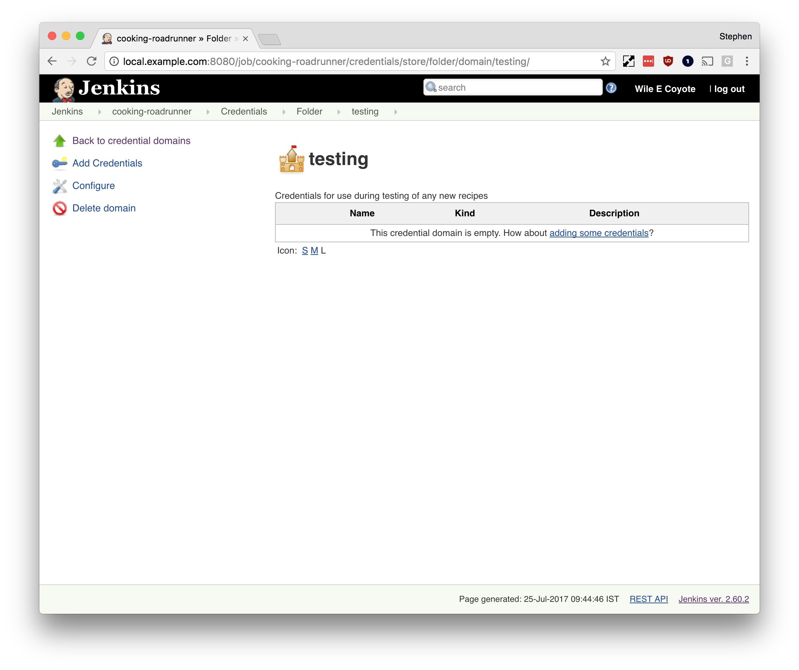

There are three columns:

// TODO there should probably be four columns (add ID) and change Kind to Type

* Name
* Kind
* Description

Adding credentials requires selection of the type of credentials to add.
A credentials instance cannot be changed from one type to another, though you can update the credentials with new secrets.

.Adding credentials to a credentials domain
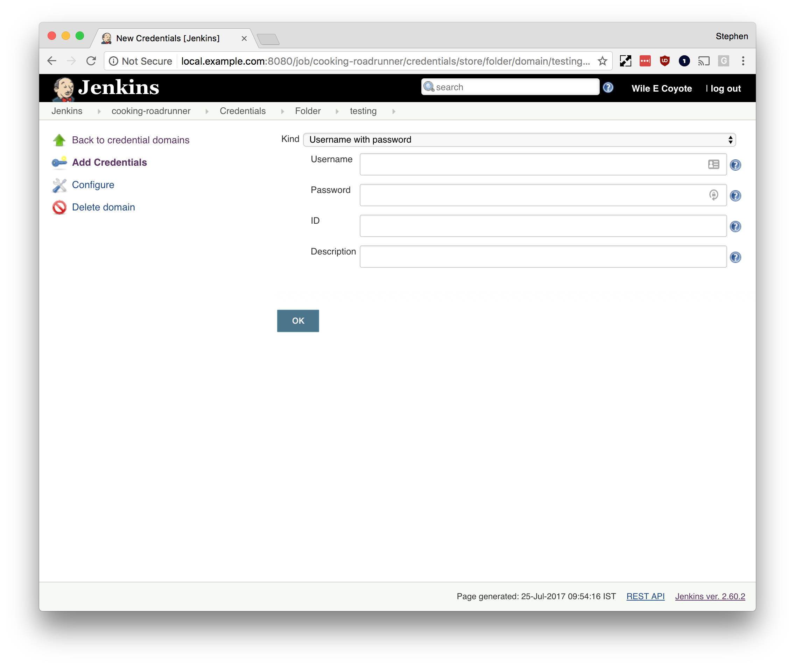

Each credentials type defines its own fields, but all credentials should have the following common fields:

Scope::
If the credentials domain is in a credentials store that supports multiple scopes then you will be able to select the credentials scope.
+
[NOTE]
.Credential scope
====
When exposing a credentials from the Jenkins root object, you will also need to decide what scope to give the exposed credentials.

* Using the `SYSTEM` scope will allow the credentials to be used for launching Jenkins agents as well as for some secondary system wide processes configured through the menu:Jenkins[Manage Jenkins > Configure Jenkins] screen.
The credential will not be available to jobs within Jenkins.

* Using the `GLOBAL` scope will, in addition to the usage permitted by `SYSTEM` scope, will make the credential available to all jobs within Jenkins running as an authentication that has the `Credentials/UseItem` permission.
====
ID::
The credentials ID is used to persist references to a credentials in job configuration, etc
[[credentials-ids]]
.Credentials IDs
[TIP]
====
The Credentials API plugin assigns a semi-unique identifier to every credentials.

It is strongly likely that you will need to reference credentials from pipeline scripts.
Make your life easier and assign the credentials ID rather than relying on the randomly generated UUID.

When giving credentials an ID, remember that the credentials storage may be migrated to an external credentials store.
Because we cannot know _a priori_ what will be valid IDs in an external credentials store it is recommended to follow some basic principles in assigning IDs:

* Keep them less than approximately 40 characters long
* Keep to alpha-numeric with `-`, `_` and `.` as separators
====
Description::
The description is an optional text field.
Normally when displaying a list of credentials for selection, the description will be appended to the credentials name, so this field can be useful to help users select the appropriate credentials in cases where there may be confusion.

The credentials details screen for each credentials will show the usage tracking information available for that credentials instance:

.A credentials instance that has not been used yet
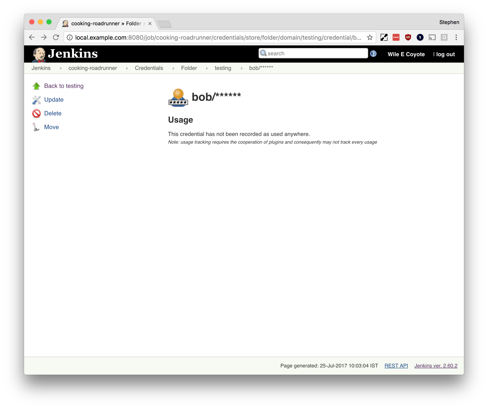

As the credentials are used by different jobs, the usage tracking information should be populated.

[NOTE]
--
The cooperation of credentials consumer plugins is required in order to track usage.
The usage tracking information should not be considered as definitive.
--

.A credentials instance that has been tracked as used.
image::images/credentials-used.png[scaledwidth="90%"]

There are three actions available on a credentials instance:

Update:: Allows changing the fields of the credentials instance.
Delete:: Removes the credentials instance.
Move:: Allows moving the credentials instance to another domain in the same credentials store.
+
[NOTE]
====
It is not currently possible to move a credentials instance from one store to another store (link:https://issues.jenkins-ci.org/browse/JENKINS-20075[JENKINS-20075]).

There are potential issues with allowing credentials instances to be moved from one store to another.
In the event that the feature is ever implemented, it is likely that moving between stores would be restricted to moving between stores from the same provider.
====

==== REST API

The REST API for managing credentials uses the similar URLs as the Web UI.

[TIP]
====
Your Jenkins instance probably has CSRF protection enabled or uses authentication then you will need to provide the required headers to the REST request.
Details of the exact headers required depends on the CSRF protection that has been configured and the exact authentication mechanism being used.
====

===== Listing domains

The most basic URLs for listing the domains in a store are:

* `http://_jenkins root url_/_path to context_/credentials/store/_store id_/api/xml?tree=domains[urlName]` for the XML representation
* `http://_jenkins root url_/_path to context_/credentials/store/_store id_/api/json?tree=domains[urlName]` for the JSON representation

This URL expects a `GET` request.
You can modify the `tree=...` query parameter to fetch additional data.

.Example of retrieving the XML representation of domains stored in the folder store `/example-folder` folder
[source,bash]
----
$ curl -g https://jenkins.example.com/job/example-folder/credentials/store/folder/\
api/xml?tree=domains[urlName]
<credentialsStoreActionImpl _class='com.cloudbees.hudson.plugins.folder.properties.FolderCredentialsProvider$FolderCredentialsProperty$CredentialsStoreActionImpl'>
  <domains>
    <_ _class='com.cloudbees.plugins.credentials.CredentialsStoreAction$DomainWrapper'>
      <urlName>_</urlName>
    </_>
    <production _class='com.cloudbees.plugins.credentials.CredentialsStoreAction$DomainWrapper'>
      <urlName>production</urlName>
    </production>
    <testing _class='com.cloudbees.plugins.credentials.CredentialsStoreAction$DomainWrapper'>
      <urlName>testing</urlName>
    </testing>
  </domains>
</credentialsStoreActionImpl>
----
<1> Whitespace has been added to the response to make a more readable example

.Example of retrieving the JSON representation of credentials IDs stored in the `testing` credentials domain in the `/example-folder` folder
[source,bash]
----
$ curl -g https://jenkins.example.com/job/example-folder/credentials/store/folder/\
api/json?tree=domains[urlName]
{
  "_class":"com.cloudbees.hudson.plugins.folder.properties.FolderCredentialsProvider$FolderCredentialsProperty$CredentialsStoreActionImpl",
  "domains":{
    "_":{
      "_class":"com.cloudbees.plugins.credentials.CredentialsStoreAction$DomainWrapper",
      "urlName":"_"
    },
    "production":{
      "_class":"com.cloudbees.plugins.credentials.CredentialsStoreAction$DomainWrapper",
      "urlName":"production"
    },
    "testing":{
      "_class":"com.cloudbees.plugins.credentials.CredentialsStoreAction$DomainWrapper",
      "urlName":"testing"
    }
  }
}
----
<1> Whitespace has been added to the response to make a more readable example

===== Creating a domain

The URL for creating a domain is: `http://_jenkins root url_/_path to context_/credentials/store/_store id_/createDomain`.
This URL expects a `POST` request with a `Content-Type` header of type `application/xml`.
The body of the `POST` request should be the XML configuration of the credentials domain.

The expected responses are:

HTTP/200::
Success, the domain has been created.
HTTP/400::
Bad request, this credentials store does not support user created credentials domains.
HTTP/409::
Failure, a domain with that name already exists.
HTTP/50x::
Could not parse the supplied domain XML body.

.Example of adding a `testing` credentials domain the `/example-folder` folder.
[source,bash]
----
$ cat > domain.xml <<EOF
<com.cloudbees.plugins.credentials.domains.Domain>
  <name>testing</name>
  <description>Credentials for use during testing of any new recipes</description>
  <specifications>
    <com.cloudbees.plugins.credentials.domains.HostnameSpecification>
      <includes>*.test.example.com</includes>
      <excludes></excludes>
    </com.cloudbees.plugins.credentials.domains.HostnameSpecification>
  </specifications>
</com.cloudbees.plugins.credentials.domains.Domain>
EOF
$ curl -X POST -H content-type:application/xml -d @domain.xml \
https://jenkins.example.com/job/example-folder/credentials/store/folder/\
createDomain
----

===== Managing the configuration of an existing domain

The URL for managing the configuration of an existing domain is: `http://_jenkins root url_/_path to context_/credentials/store/_store id_/domain/_domain name_/config.xml`.
This URL expects `GET`, `POST` or `DELETE` request.

A `GET` request will retrieve the existing configuration.
The expected response is:

HTTP/200::
Success, the body of the response is the XML representation of the credentials domain.

.Example of retrieving the configuration of the `testing` credentials domain in the `/example-folder` folder
[source,bash]
----
$ curl https://jenkins.example.com/job/example-folder/credentials/store/folder/\
domain/testing/config.xml
<com.cloudbees.plugins.credentials.domains.Domain plugin="credentials@2.1.14">
  <name>testing</name>
  <description>Credentials for use during testing of any new recipes</description>
  <specifications>
    <com.cloudbees.plugins.credentials.domains.HostnameSpecification>
      <includes>*.test.example.com</includes>
      <excludes></excludes>
    </com.cloudbees.plugins.credentials.domains.HostnameSpecification>
  </specifications>
</com.cloudbees.plugins.credentials.domains.Domain>
----

A `POST` request will update the existing configuration.
The expected response is:

HTTP/200::
Success.

.Example of updating the configuration of the `testing` credentials domain in the `/example-folder` folder
[source,bash]
----
$ cat > domain.xml <<EOF
<com.cloudbees.plugins.credentials.domains.Domain>
 <name>testing</name>
 <description>Credentials for use against the *.test.example.com hosts</description>
 <specifications>
   <com.cloudbees.plugins.credentials.domains.HostnameSpecification>
     <includes>*.test.example.com</includes>
     <excludes></excludes>
   </com.cloudbees.plugins.credentials.domains.HostnameSpecification>
 </specifications>
</com.cloudbees.plugins.credentials.domains.Domain>
EOF
$ curl -X POST -H content-type:application/xml -d @domain.xml \
https://jenkins.example.com/job/example-folder/credentials/store/folder/\
domain/testing/config.xml
----

A `DELETE` requests will remove the credentials domain and all credentials associated with the domain.
The expected response is:

HTTP/200::
Success.

.Example of removing the `testing` credentilas domain from the `/example-folder` folder
[source,bash]
----
$ curl -X DELETE https://jenkins.example.com/job/example-folder/credentials/store/folder/\
domain/testing/config.xml
----

===== Listing credentials within a credentials domain.

The most basic URLs for listing the credentials in a domain are:

* `http://_jenkins root url_/_path to context_/credentials/store/_store id_/domain/_domain name_/api/xml?tree=credentials[id]` for the XML representation
* `http://_jenkins root url_/_path to context_/credentials/store/_store id_/domain/_domain name_/api/json?tree=credentials[id]` for the JSON representation

This URL expects a `GET` request.
You can modify the `tree=...` query parameter to fetch additional data.

.Example of retrieving the XML representation of credentials IDs stored in the `testing` credentials domain in the `/example-folder` folder
[source,bash]
----
$ curl -g https://jenkins.example.com/job/example-folder/credentials/store/folder/\
domain/testing/api/xml?tree=credentials[id]
<domainWrapper _class='com.cloudbees.plugins.credentials.CredentialsStoreAction$DomainWrapper'>
  <credential>
    <id>deploy-key</id>
  </credential>
  <credential>
    <id>c5e80c99-d7c3-4acb-a5e1-73592ceebbbc</id>
  </credential>
</domainWrapper>
----
<1> Whitespace has been added to the response to make a more readable example

.Example of retrieving the JSON representation of credentials IDs stored in the `testing` credentials domain in the `/example-folder` folder
[source,bash]
----
$ curl -g https://jenkins.example.com/job/example-folder/credentials/store/folder/\
domain/testing/api/json?tree=credentials[id]
{
  "_class":"com.cloudbees.plugins.credentials.CredentialsStoreAction$DomainWrapper",
  "credentials":[
    {"id":"deploy-key"},
    {"id":"c5e80c99-d7c3-4acb-a5e1-73592ceebbbc"}
  ]
}
----
<1> Whitespace has been added to the response to make a more readable example

===== Creating a credentials

The URL for creating a domain is: `http://_jenkins root url_/_path to context_/credentials/store/_store id_/domain/_domain name_/createCredentials`.
This URL expects a `POST` request with a `Content-Type` header of type `application/xml`.
The body of the `POST` request should be the XML configuration of the credentials domain.

[TIP]
====
The global domain has the name `_`
====

The expected responses are:

HTTP/200::
Success, the credentials has been created.
HTTP/409::
Failure, a credentiasl with that id already exists.
HTTP/50x::
Could not parse the supplied domain XML body.

.Example of adding a `deploy-key` credential using the username `wecoyote` and the password `secret123` in the `testing` domain of the `/example-folder` folder.
[source,bash]
----
$ cat > credential.xml <<EOF
<com.cloudbees.plugins.credentials.impl.UsernamePasswordCredentialsImpl>
  <scope>GLOBAL</scope>
  <id>deploy-key</id>
  <username>wecoyote</username>
  <password>secret123</password>
</com.cloudbees.plugins.credentials.impl.UsernamePasswordCredentialsImpl>
EOF
$ curl -X POST -H content-type:application/xml -d @credential.xml \
https://jenkins.example.com/job/example-folder/credentials/store/folder/\
domain/testing/createCredentials
----

[TIP]
====
The secret is passed _in the clear_ so that Jenkins can then encrypt it before storing to disk.
====

===== Managing an existing credentials instance

The URL for managing the an existing credentials instance is: `http://_jenkins root url_/_path to context_/credentials/store/_store id_/domain/_domain name_/credential/_credentials id_/config.xml`.
This URL expects `GET`, `POST` or `DELETE` request.

A `GET` request will retrieve the existing configuration.
The expected response is:

HTTP/200::
Success, the body of the response is the XML representation of the credentials domain.
+
[NOTE]
====
The secret portion of the credentials instance will always be replaced with `<secret-redacted/>`
====

.Example of retrieving the configuration of the `deploy-key` credential from the `testing` credentials domain in the `/example-folder` folder
[source,bash]
----
$ curl https://jenkins.example.com/job/example-folder/credentials/store/folder/\
domain/testing/credentials/deploy-key/config.xml
<com.cloudbees.plugins.credentials.impl.UsernamePasswordCredentialsImpl plugin="credentials@2.1.14">
  <scope>GLOBAL</scope>
  <id>deploy-key</id>
  <username>wecoyote</username>
  <password>
    <secret-redacted/>
  </password>
</com.cloudbees.plugins.credentials.impl.UsernamePasswordCredentialsImpl>
----

A `POST` request will update the existing configuration.
The expected response is:

HTTP/200::
Success.

.Example of updating the details of the `deploy-key` credentials instance in the `testing` credentials domain in the `/example-folder` folder
[source,bash]
----
$ cat > credential.xml <<EOF
<com.cloudbees.plugins.credentials.impl.UsernamePasswordCredentialsImpl>
  <scope>GLOBAL</scope>
  <id>deploy-key</id>
  <username>wecoyote</username>
  <password>pAssw0rd</password>
</com.cloudbees.plugins.credentials.impl.UsernamePasswordCredentialsImpl>
EOF
$ curl -X POST -H content-type:application/xml -d @domain.xml \
https://jenkins.example.com/job/example-folder/credentials/store/folder/\
domain/testing/credentials/deploy-key/config.xml
----

A `DELETE` requests will remove the credentials .
The expected response is:

HTTP/200::
Success.

.Example of removing the `deploy-key` credentials instance from the `testing` credentilas domain in the `/example-folder` folder
[source,bash]
----
$ curl -X DELETE https://jenkins.example.com/job/example-folder/credentials/store/folder/\
domain/testing/credentials/deploy-key/config.xml
----

==== Jenkins Command Line Interface

===== Navigating credentials stores

Unlike the Web UI or the REST API which can infer the credentials store from the URL, the Jenkins CLI needs to know how to identify the credentials store that you intend to operate on.

The Jenkins CLI interface uses a composite Store Id.
The Store Id consists of three components separated by the `::`.
The components are  _provider_ `::` _resolver_ `::` _context path_.

TThe Credentials API provides implementations for three stores, but as the stores are an extension point it is probable best to illustrate the general process for identifying the store id:

1. List the credentials providers:
+
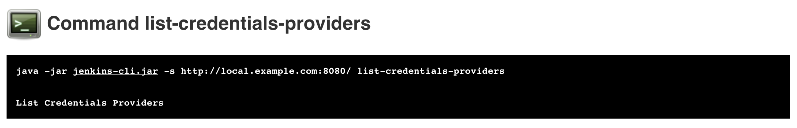
+
.Listing the credentials providers
[source,bash]
----
$ java -jar jenkins-cli.jar -s https://jenkins.example.com/ \
list-credentials-providers
Name                                                                           Provider
============================================================================== ==============================
FolderCredentialsProvider                                                      Folder Credentials Provider
SystemCredentialsProvider                                                      Jenkins Credentials Provider
UserCredentialsProvider                                                        User Credentials Provider
com.cloudbees.hudson.plugins.folder.properties.FolderCredentialsProvider       Folder Credentials Provider
com.cloudbees.plugins.credentials.SystemCredentialsProvider$ProviderImpl       Jenkins Credentials Provider
com.cloudbees.plugins.credentials.UserCredentialsProvider                      User Credentials Provider
folder                                                                         Folder Credentials Provider
system                                                                         Jenkins Credentials Provider
user                                                                           User Credentials Provider
----
+
The each Credentials Provider is exposed using up to three different names (the names are derived by code and simplifications are only exposed if there are no conflicting credentials provider implementations). In the case of the root system credentials store, the most specific provider identifier is `com.cloudbees.plugins.credentials.SystemCredentialsProvider$ProviderImpl` but in the above instance we also have available the short form `system`.

2. List the context resolvers
+
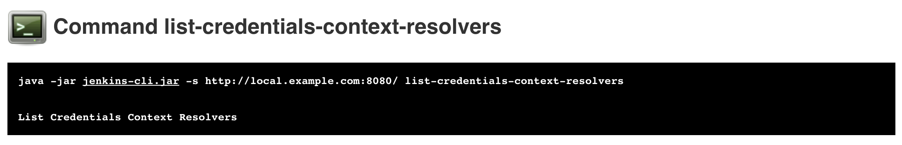
+
.Listing the context resolvers
[source,bash]
----
$ java -jar jenkins-cli.jar -s https://jenkins.example.com/ \
list-credentials-context-resolvers
Name                                                                            Resolves
=============================================================================== =======
ItemContextResolver                                                             Items
SystemContextResolver                                                           Jenkins
UserContextResolver                                                             Users
com.cloudbees.plugins.credentials.CredentialsSelectHelper$ItemContextResolver   Items
com.cloudbees.plugins.credentials.CredentialsSelectHelper$SystemContextResolver Jenkins
com.cloudbees.plugins.credentials.CredentialsSelectHelper$UserContextResolver   Users
item                                                                            Items
system                                                                          Jenkins
user                                                                            Users
----
+
While context resolvers are also an extension point, it is probably unlikely that plugins will find it necessary to define new resolvers in addition to the standard ones.
Normally the context resolvers that we want are either `com.cloudbees.plugins.credentials.CredentialsSelectHelper$SystemContextResolver` (which has the short alias of `system`) or `com.cloudbees.plugins.credentials.CredentialsSelectHelper$ItemContextResolver` (which has the short alias of `item`)
+
If you want to interact with your own per-user credential store then you will want the `com.cloudbees.plugins.credentials.CredentialsSelectHelper$UserContextResolver` (which has the short alias of `user`)

3. Specify the context path
+
* For the `system` context resolver, this is always the fixed value `jenkins`.
* For the `item` context resolver, this is the full name of the item (folder).
The full name is normally the names separated by '/' characters.
The full name is not the URL of the job as that includes `/job/` in the URL.
For example a folder with the URL `http://local.example.com/jenkins/job/example-folder/job/example-sub-folder/` would have the full name `/example-folder/example-sub-folder`
+
[NOTE]
====
The `config.xml` of that folder would - by default - be stored in `$JENKINS_HOME/jobs/example-folder/jobs/example-sub-folder`.

The breadcrumb bar, if the display name has been customized for these folders might look like `Jenkins » Example Folder » Example Sub-Folder`)
====
* For the `user` context resolver, this is the username.

So the some possible Store Id variants are:

* `system::system::jenkins` for the root credentials store
* `folder::item::/full/name/of/folder` for a per-folder credentials store
* `user::user::wecoyote` for the per-user store of Wile E. Coyote, who's username is `wecoyote`.

// TODO ===== Listing domains

===== Listing credentials and domains

The CLI Command for listing credentials and domains in a credentials store is `list-credentials`.

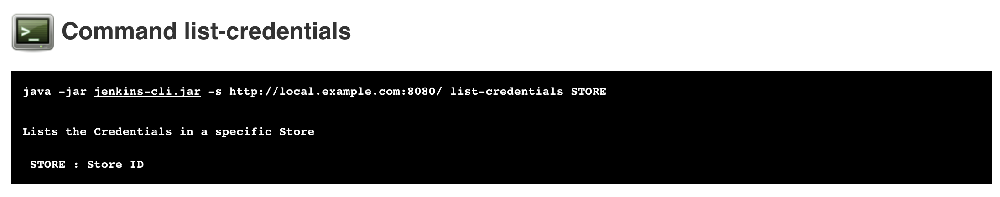

.Example of listing the credentials and domains in the `/example-folder` folder.
[source,bash]
----
$ java -jar jenkins-cli.jar -s https://jenkins.example.com/ \
list-credentials folder::item::/example-folder
===============================================
Domain                               (global)
Description
# of Credentials                     1
===============================================
Id                                   Name
==================================== ==========
7d9702ee-9ce3-4ecd-82b5-9ebe125459fb bob/******
===============================================

=================================================
Domain                               production
Description                          Credentials used for the production roadrunner cooking infrastructure
# of Credentials                     1
=================================================
Id                                   Name
==================================== ============
ae68086e-ccb1-43cc-8820-4f111bceda7c wilma/******
=================================================

====================================================
Domain                               testing
Description                          Credentials for use during testing of any new recipes
# of Credentials                     2
====================================================
Id                                   Name
==================================== ===============
deploy-key                           wecoyote/******
c5e80c99-d7c3-4acb-a5e1-73592ceebbbc fred/******
====================================================
----

===== Listing domains and credentials as XML

The CLI Command for listing credentials and domains in XML format in a credentials store is `list-credentials-as-xml`.

.Example of listing the credentials and domains as XML in the `/example-folder` folder.
[source,bash]
----
$ java -jar jenkins-cli.jar -s https://jenkins.example.com/ \
list-credentials-as-xml folder::item::/example-folder
<list>
  <com.cloudbees.plugins.credentials.domains.DomainCredentials plugin="credentials@2.1.17-SNAPSHOT">
    <domain>
      <specifications/>
    </domain>
    <credentials>
      <com.cloudbees.plugins.credentials.impl.UsernamePasswordCredentialsImpl>
        <id>7d9702ee-9ce3-4ecd-82b5-9ebe125459fb</id>
        <description></description>
        <username>bob</username>
        <password>
          <secret-redacted/>
        </password>
      </com.cloudbees.plugins.credentials.impl.UsernamePasswordCredentialsImpl>
    </credentials>
  </com.cloudbees.plugins.credentials.domains.DomainCredentials>
  <com.cloudbees.plugins.credentials.domains.DomainCredentials plugin="credentials@2.1.17-SNAPSHOT">
    <domain>
      <name>production</name>
      <description>Credentials used for the production roadrunner cooking infrastructure</description>
      <specifications/>
    </domain>
    <credentials>
      <com.cloudbees.plugins.credentials.impl.UsernamePasswordCredentialsImpl>
        <id>ae68086e-ccb1-43cc-8820-4f111bceda7c</id>
        <description></description>
        <username>wilma</username>
        <password>
          <secret-redacted/>
        </password>
      </com.cloudbees.plugins.credentials.impl.UsernamePasswordCredentialsImpl>
    </credentials>
  </com.cloudbees.plugins.credentials.domains.DomainCredentials>
  <com.cloudbees.plugins.credentials.domains.DomainCredentials plugin="credentials@2.1.17-SNAPSHOT">
    <domain>
      <name>testing</name>
      <description>Credentials for use during testing of any new recipes</description>
      <specifications/>
    </domain>
    <credentials>
      <com.cloudbees.plugins.credentials.impl.UsernamePasswordCredentialsImpl>
        <id>deploy-key</id>
        <description></description>
        <username>wecoyote</username>
        <password>
          <secret-redacted/>
        </password>
      </com.cloudbees.plugins.credentials.impl.UsernamePasswordCredentialsImpl>
      <com.cloudbees.plugins.credentials.impl.UsernamePasswordCredentialsImpl>
        <id>c5e80c99-d7c3-4acb-a5e1-73592ceebbbc</id>
        <description></description>
        <username>fred</username>
        <password>
          <secret-redacted/>
        </password>
      </com.cloudbees.plugins.credentials.impl.UsernamePasswordCredentialsImpl>
    </credentials>
  </com.cloudbees.plugins.credentials.domains.DomainCredentials>
</list>
----

The output of the command can be used as input for `import-credentials-as-xml` as is, the only needed change is to set the actual
Secrets which are redacted in the output.

===== Importing domains and credentials as XML

The CLI Command for importing credentials and domains in XML format in a credentials store is `import-credentials-as-xml`.
The command read the XML from standard input.

.Example of importing the credentials and domains to the `/example-folder` folder.
[source,bash]
----
$ java -jar jenkins-cli.jar -s https://jenkins.example.com/ \
import-credentials-as-xml folder::item::/example-folder < credentials.xml
----

If a domain already exists it is not modified, credentials are added to it.
If a credential already exists nothing is done on it.
If a domain or a credential exists in the instance but not in the input XML, they are kept in the instance.

===== Creating a domain

The CLI command for creating a credentials domain is `create-credentials-domain-by-xml`.

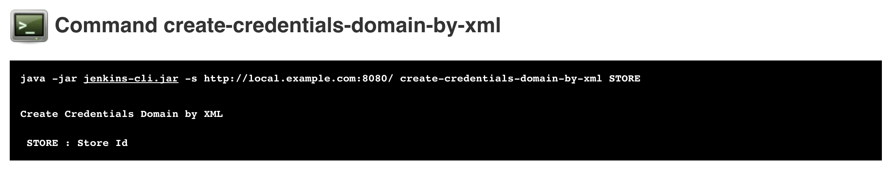

This command takes the XML configuration from standard input

.Example of adding a `testing` credentials domain the `/example-folder` folder.
[source,bash]
----
$ cat > domain.xml <<EOF
<com.cloudbees.plugins.credentials.domains.Domain>
  <name>testing</name>
  <description>Credentials for use during testing of any new recipes</description>
  <specifications>
    <com.cloudbees.plugins.credentials.domains.HostnameSpecification>
      <includes>*.test.example.com</includes>
      <excludes></excludes>
    </com.cloudbees.plugins.credentials.domains.HostnameSpecification>
  </specifications>
</com.cloudbees.plugins.credentials.domains.Domain>
EOF
$ java -jar jenkins-cli.jar -s https://jenkins.example.com/ \
create-credentials-domain-by-xml folder::item::/example-folder < domain.xml
----

===== Retrieving a domain's configuration

The CLI command for retrieving a credentials domain configuration is `get-credentials-domain-as-xml`

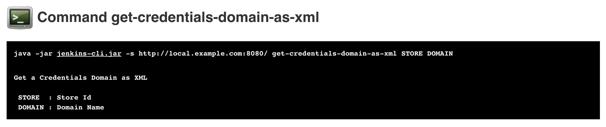

.Example of retrieving the configuration of the `testing` credentials domain from the `/example-folder` folder.
[source,bash]
----
$ $ java -jar jenkins-cli.jar -s https://jenkins.example.com/ \ get-credentials-domain-as-xml folder::item::/example-folder testing
<com.cloudbees.plugins.credentials.domains.Domain plugin="credentials@2.1.14">
  <name>testing</name>
  <description>Credentials for use during testing of any new recipes</description>
  <specifications>
    <com.cloudbees.plugins.credentials.domains.HostnameSpecification>
      <includes>*.test.example.com</includes>
      <excludes></excludes>
    </com.cloudbees.plugins.credentials.domains.HostnameSpecification>
  </specifications>
</com.cloudbees.plugins.credentials.domains.Domain>
----

===== Updating a domain

The CLI command for updating an existing credentials domain is `update-credentials-domain-by-xml`

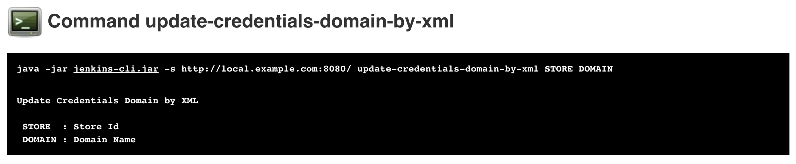

This command takes the XML configuration from standard input

.Example of updating the `testing` credentials domain in the `/example-folder` folder.
[source,bash]
----
$ cat > domain.xml <<EOF
<com.cloudbees.plugins.credentials.domains.Domain>
  <name>testing</name>
  <description>Credentials for use during testing of any new recipes</description>
  <specifications>
    <com.cloudbees.plugins.credentials.domains.HostnameSpecification>
      <includes>*.test.example.com</includes>
      <excludes></excludes>
    </com.cloudbees.plugins.credentials.domains.HostnameSpecification>
  </specifications>
</com.cloudbees.plugins.credentials.domains.Domain>
EOF
$ java -jar jenkins-cli.jar -s https://jenkins.example.com/ \
update-credentials-domain-by-xml folder::item::/example-folder testing < domain.xml
----

===== Removing a domain

The CLI command for deleting a credentials domain and all associated credentials is `delete-credentials-domain`

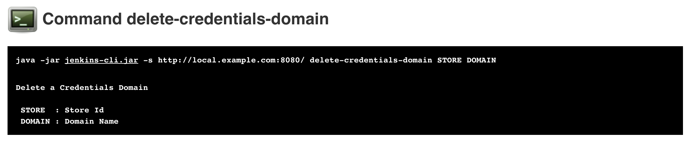

.Example of deleting the `testing` credentials domain from the `/example-folder` folder.
[source,bash]
----
$ java -jar jenkins-cli.jar -s https://jenkins.example.com/ \
delete-credentials-domain folder::item::/example-folder testing
----

===== Creating credentials

The `create-credentials-by-xml` Jenkins CLI command is the command used to expose credentials.

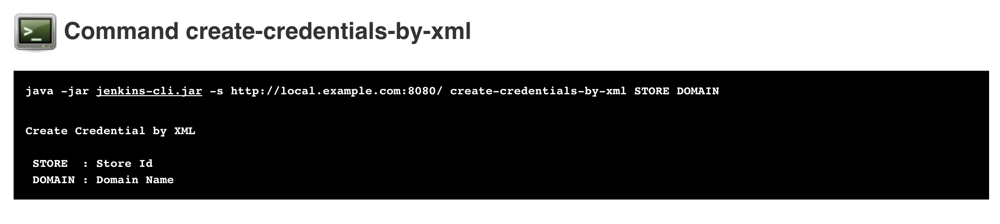

This command needs the XML representation of the credential we want to expose.
The best way to get this is to inspect the configuration of an existing credential of the same type.

If we navigate using a Web browser to find an existing credential, we will end up at an URL something like: `https://jenkins.example.com/credentials/store/system/domain/_/credential/some-credential-id/` by appending `config.xml` to the URL we can see the configuration of that credentials, e.g.:

.Inspecting the `config.xml` of an existing username password credential.
[source,xml]
----
<com.cloudbees.plugins.credentials.impl.UsernamePasswordCredentialsImpl plugin="credentials@2.1.14">
  <scope>GLOBAL</scope>
  <id>some-credential-id</id>
  <description>This is an example username password credential</description>
  <username>wecoyote</username>
  <password>
    <secret-redacted/>
  </password>
</com.cloudbees.plugins.credentials.impl.UsernamePasswordCredentialsImpl>
----

.Inspecting the `config.xml` of an existing SSH private key credential.
[source,xml]
----
<com.cloudbees.jenkins.plugins.sshcredentials.impl.BasicSSHUserPrivateKey plugin="ssh-credentials@1.13">
  <scope>GLOBAL</scope>
  <id>some-credential-id</id>
  <description>This is an example ssh key credential</description>
  <username>wecoyote</username>
  <privateKeySource class="com.cloudbees.jenkins.plugins.sshcredentials.impl.BasicSSHUserPrivateKey$DirectEntryPrivateKeySource">
    <privateKey>
      <secret-redacted/>
    </privateKey>
  </privateKeySource>
</com.cloudbees.jenkins.plugins.sshcredentials.impl.BasicSSHUserPrivateKey>
----

NOTE: when accessing credentials in this way, the secret text will be replaced by `<secret-redacted/>`

So it is just a question of providing our own `config.xml` with the appropriate content.

TIP: When providing the actual secret value, you should exploit the way Jenkins deserializes secrets. If the secret does not decrypt then it is assumed to be the corresponding unencrypted value, which Jenkins will then encrypt before persisting the credentials.

.Example of adding a `deploy-key` credential using the username `wecoyote` and the password `secret123` in the `testing` domain of the `/example-folder` folder.
[source,bash]
----
$ cat > credential.xml <<EOF
<com.cloudbees.plugins.credentials.impl.UsernamePasswordCredentialsImpl>
  <scope>GLOBAL</scope>
  <id>deploy-key</id>
  <username>wecoyote</username>
  <password>secret123</password>
</com.cloudbees.plugins.credentials.impl.UsernamePasswordCredentialsImpl>
EOF
$ java -jar jenkins-cli.jar -s https://jenkins.example.com/ \
create-credentials-by-xml folder::item::/example-folder testing < credential.xml
----

===== Retrieving credentials

The `get-credentials-as-xml` Jenkins CLI command is the command used to remove credentials.

.The Jenkins CLI command for removing credentials from a credentials store.
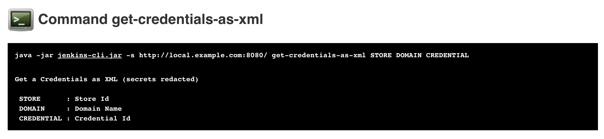

.Example of removing the `deploy-key` credential from the `testing` domain of the `/example-folder` folder.
[source,bash]
----
$ java -jar jenkins-cli.jar -s https://jenkins.example.com/ \
get-credentials-as-xml folder::item::/example-folder testing deploy-key
<com.cloudbees.plugins.credentials.impl.UsernamePasswordCredentialsImpl plugin="credentials@2.1.14">
  <scope>GLOBAL</scope>
  <id>deploy-key</id>
  <username>wecoyote</username>
  <password>
    <secret-redacted/>
  </password>
</com.cloudbees.plugins.credentials.impl.UsernamePasswordCredentialsImpl>
----

===== Updating credentials

The CLI command for updating an existing credentials domain is `update-credentials-by-xml`

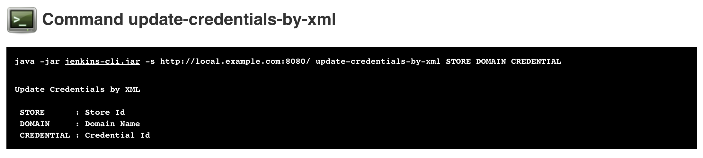

This command takes the XML configuration from standard input

.Example of updating the `deploy-key` credentials in the `testing` domain of the `/example-folder` folder.
[source,bash]
----
$ cat > credential.xml <<EOF
<com.cloudbees.plugins.credentials.impl.UsernamePasswordCredentialsImpl>
  <scope>GLOBAL</scope>
  <id>deploy-key</id>
  <username>wecoyote</username>
  <password>secret123</password>
</com.cloudbees.plugins.credentials.impl.UsernamePasswordCredentialsImpl>
EOF
$ java -jar jenkins-cli.jar -s https://jenkins.example.com/ \
update-credentials-by-xml folder::item::/example-folder testing deploy-key < credentials.xml
----

===== Deleting credentials

The `delete-credentials` Jenkins CLI command is the command used to remove credentials.

.The Jenkins CLI command for removing credentials from a credentials store.
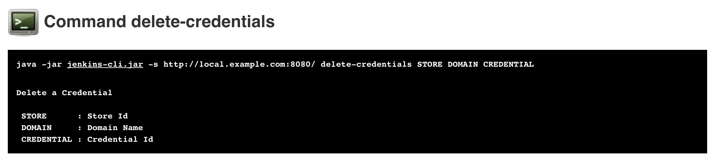

.Example of removing the `deploy-key` credential from the `testing` domain of the `/example-folder` folder.
[source,bash]
----
$ java -jar jenkins-cli.jar -s https://jenkins.example.com/ \
delete-credentials folder::item::/example-folder testing deploy-key
----

=== Using credentials

The Credentials API plugin provides a standardized control for selecting credentials.

Depending on how the consuming plugin author has configured this control it can be in one or two modes:

* Select only mode, which will look something like:
+
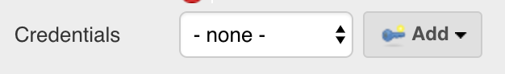
* Switchable mode, which has a radio button to allow switching between select mode
+
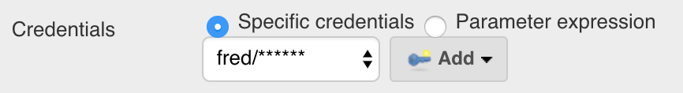
+
and expression mode
+
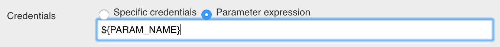

In select mode there is an _Add_ button.
This button displays a drop-down of all the credentials stores in the context.
Clicking on a store will open a modal dialog that enabled addition of credentials.

.The select control's _Add_ button menu showing available contexts
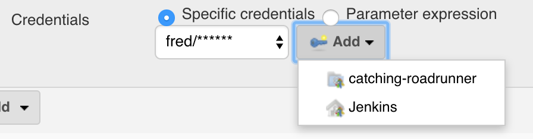

.The modal dialog for adding credentials
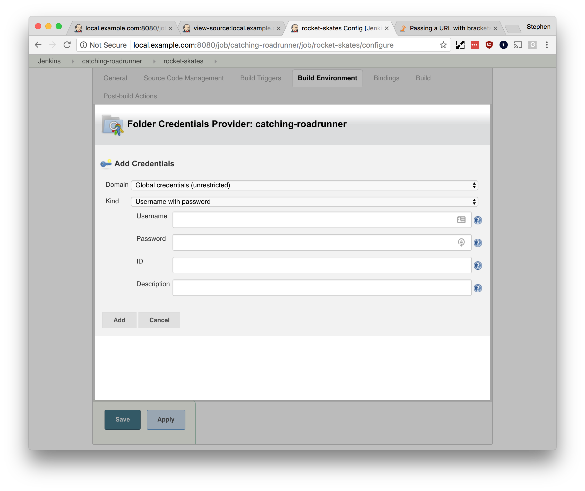

[NOTE]
====
The _Add_ dialog currently has no way to know what types of credentials are valid for the credentials select control that triggered it (link:https://issues.jenkins-ci.org/browse/JENKINS-40293[JENKINS-40293])

In general it will always open with the "first" available credentials type, which is typically Username & Password.
====

You can add credentials to any existing credentials domain in the selected credentials store.

[TIP]
====
If the browser window size is too small and hides modal dialog's _Add_ and _Cancel_ buttons, the dialog can be closed with the `ESC` key.
====

After the dialog has closed, _all_ the credentials select controls on the page will request an updated list of available credentials.

==== Credentials parameters

The Credentials API plugin defines a credentials parameter type.
Credentials parameters are only useful with credentials select controls that offer expression mode.

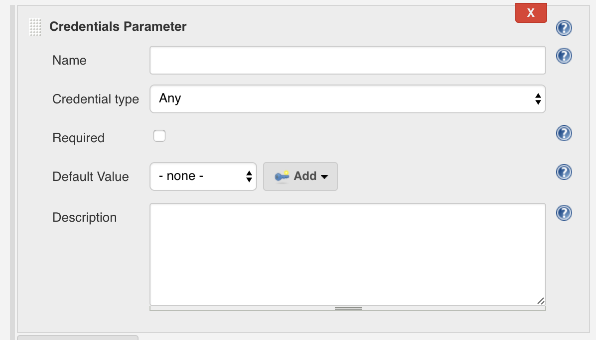

There are five fields to configure for the credentials parameter:

Name:: the name of the credentials parameter, this name will be used in the credentials expression.
Convention is to use all UPPERCASE with `_` as a word separator.
Credentials type:: the type of credentials to limit selection to.
Required:: when checked, a credentials instance must be selected, when unchecked the `- none -` option will be available.
Default Value:: the default credentials to select by default.
Description:: the description of the parameter to display to users.

In a parameterized job, you can then toggle the credentials select controls to _parameter expression_ and provide the expression in the form `${_PARAMETER NAME_}`

[NOTE]
====
Only simple parameter expressions of the form `${` followed by the parameter name followed by `}` are allowed.
====

When building the job, the user will be presented with a credentials select control in select only mode for each credentials parameter.

.Building a parameterized job with a credentials parameter
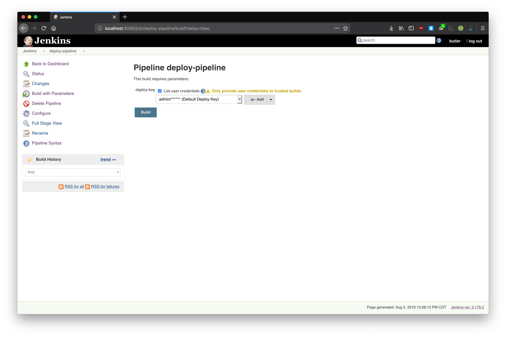

The list of available credentials will depend on a number of factors:

* If the credentials parameter definition specified a credentials type, only credentials of that type will be available for selection.
* If the user has the  https://github.com/jenkinsci/credentials-plugin/blob/dc35d4d99f9d4e9bf5fd434aee4f6e1bfca4c47d/src/main/java/com/cloudbees/plugins/credentials/CredentialsProvider.java#L144[`Credentials/UseOwn`] (which by default is implied by the `Item/Build` permission) then any suitable credentials from their own per-user credentials store will be available from the drop-down list.
* If the user has the  https://github.com/jenkinsci/credentials-plugin/blob/dc35d4d99f9d4e9bf5fd434aee4f6e1bfca4c47d/src/main/java/com/cloudbees/plugins/credentials/CredentialsProvider.java#L160[`Credentials/UseItem`] (which by default is implied by the `Job/Configure` permission) then any suitable credentials from the default authentication that the build job will run as will be available from the drop-down list.
* If the credentials parameter definition specified a default value, that value will always be present irrespective of whether the user has the https://github.com/jenkinsci/credentials-plugin/blob/dc35d4d99f9d4e9bf5fd434aee4f6e1bfca4c47d/src/main/java/com/cloudbees/plugins/credentials/CredentialsProvider.java#L160[`Credentials/UseItem`] permission.

[WARNING]
====
Credentials parameters can only access the per-user credentials store of the job that was explicitly triggered by the user.

Downstream jobs will be passed the credentials ID but will not be passed access to the user's per-user credentials store.
This restriction is to prevent a malicious actor adding a hidden job as a downstream job and thereby gaining access to the per-user credentials store.
====

The credentials parameter value will be the ID of the selected credentials.
Use the link:https://plugins.jenkins.io/credentials-binding[Credentials Binding] plugin if you need to get access to the secrets of a credentials instance, for example to use a password for authenticating a request to a third party system.

==== Configuration as code (aka jcasc)
This plugin supports the https://github.com/jenkinsci/configuration-as-code-plugin[configuration-code-plugin] to manage credentials through yaml

You can find out what the yaml should be by:

. configuring the credential in the UI first
. going to the "Configuration as Code" admin page and clicking "View Configuration"

Note the credential will be exported in encrypted form, it isn't recommended to use this when loading credentials.

See the jcasc docs for how to make secrets available while loading credentials: https://github.com/jenkinsci/configuration-as-code-plugin#handling-secrets

A basic example config:
[source,yaml]
----
credentials:
  system:
    domainCredentials:
      - domain:
          name: "test.com"
          description: "test.com domain"
          specifications:
            - hostnameSpecification:
                includes: "*.test.com"
        credentials:
          - usernamePassword:
              scope:    SYSTEM
              id:       sudo_password
              username: root
              password: "${SUDO_PASSWORD}"

----
